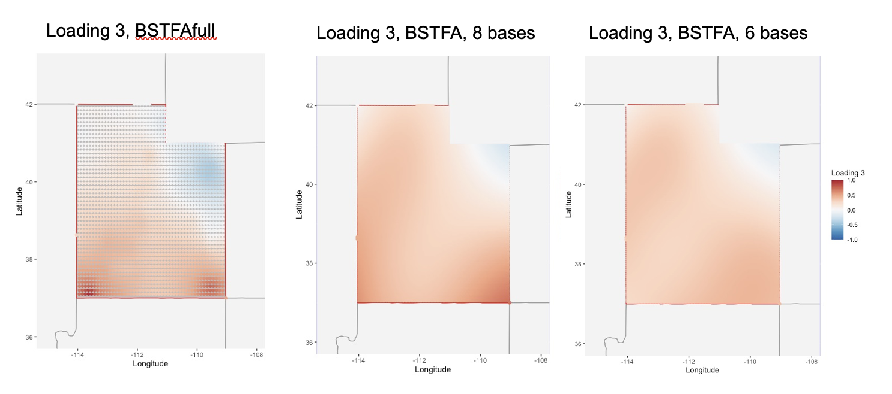
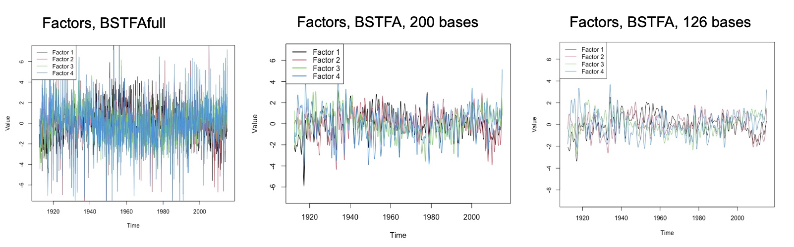
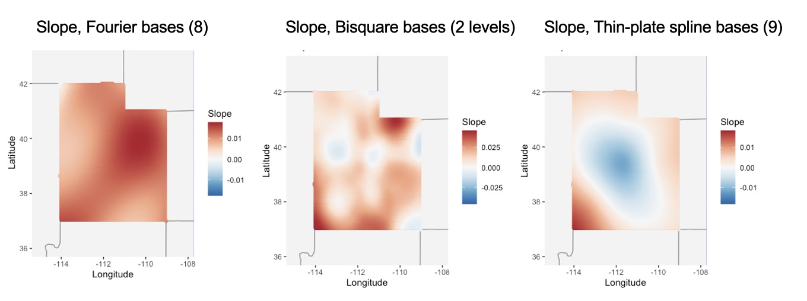

```{r, include = FALSE}
knitr::opts_chunk$set(
  collapse = TRUE,
  comment = "#>",
  cache=FALSE
)
```

```{r setup, echo=FALSE, include=FALSE}
library(knitr)
devtools::load_all()
# library(BSTFA)
```


```{r, echo=FALSE, include=FALSE}
# load('/Users/adamiser/Desktop/Research/TempDataForSTFA.Rdata')
# 
# Cmoonmean <- locdat.T
# for(i in 1:n.locations){
#   Cmoonmean[,i] <- locdat.T[,i] - mean(locdat.T[,i], na.rm=T)
# }
# Cmoonmean.T <- Cmoonmean
# missing <- which(is.na(Cmoonmean)==T)
# Cmoonmean <- as.matrix(Cmoonmean)
# y <- c(Cmoonmean)
# doy = as.numeric(x_set)
# ymat = Cmoonmean
# coords = rbind(gauges.reg[,c(2,3)])
# 
# ymat.use = ymat[200:1450,]
# mydate.use = mydate[200:1450]
# 
# utahDataList = list('TemperatureVals' = ymat.use,
#                     'Dates' = mydate.use,
#                     'Coords' = coords,
#                     'Locations' = gauges.reg$Station)
# 
# usethis::use_data(utahDataList,overwrite=TRUE)

# devtools::load_all()
# out = STFA(iters=10000,ymat=utahDataList$TemperatureVals,
#            dates=utahDataList$Dates,
#            coords=utahDataList$Coords,
#            factors.fixed = c(144,89,129,78), n.seasn.knots=7,
#            spatial.style='fourier', load.style='fourier', plot.factors = FALSE,
#            n.spatial.bases = 8, n.load.bases = 8,
#            freq.lat = 40, freq.lon = 30)
# computation.summary(out)
# check.convergence(out)
# 
# plot.location(out,location=10)
# 
# plot.grid(out,parameter='slope')
# plot.grid(out,parameter='loadings',loading=1)
# plot.grid(out,parameter='loadings',loading=2)
# plot.grid(out,parameter='loadings',loading=3)
# plot.grid(out,parameter='loadings',loading=4)
# 
# plot.factor(out, together=TRUE)
# 
# plot.trace(out, parameter='beta', param.range=1:5)
# 
# plot.annual(out,location=10)
# 
# devtools::load_all()
# plot.map(out,parameter='slope',location='utah',state=TRUE,map=TRUE,
#          with.uncertainty = FALSE)
# 
# predictBSTFA(out,location=data.frame('Longitude' = -111.96, 'Latitude' = 41.06),type='mean')
# plot.location(out,location=10,truth=TRUE)
# plot.location(out,location=data.frame('Longitude' = -111.96, 'Latitude' = 41.06))
# 
# preds = preds
```


```{r, echo=FALSE, include=FALSE}
# devtools::load_all()
# 
# out = BSTFA(iters=100,ymat=utahDataList$TemperatureVals,
#            dates=utahDataList$Dates,
#            coords=as.matrix(utahDataList$Coords),
#            factors.fixed = c(144,89,129,78), n.seasn.knots=7,
#            spatial.style='fourier', load.style='fourier',
#            n.load.bases = 8, n.spatial.bases = 12, n.temp.bases=126,
#            verbose=FALSE, plot.factors=FALSE)
# 
# par(mfrow=c(1,1))
# plot.location(out,1,xrange=c('1969-01-01', '1979-01-01'),truth = TRUE,pred.int=TRUE)
# devtools::load_all()
# 
# preds1 = predictSTFA(out,location=1,type='ub')
# 
# preds2 = predictSTFA(out,location=1,type='ub')
# 
# 
# 
# plot.location(out, location=data.frame('Longitude' = -111.96, 'Latitude' = 41.06),
#        uncertainty=TRUE, xrange=c('1959-01-01', '1979-01-01'), pred.int=TRUE)
# plot.location(out, location=ttt,
#           uncertainty=TRUE, xrange=c('1959-01-01', '1979-01-01'))
# 
# plot.grid(out,parameter='loadings',loadings=1)
# plot.grid(out,parameter='slope')
# 
# plot.map(out,parameter='slope',location='utah',state=TRUE,map=TRUE,
#          with.uncertainty = TRUE)
# plot.map(out,parameter='slope',location='utah',state=TRUE,map=TRUE,
#          with.uncertainty = FALSE)
# plot.map(out,parameter='loading',location='utah',state=TRUE,map=TRUE,
#          with.uncertainty = FALSE, loading=1)
# plot.map(out,parameter='loading',location='utah',state=TRUE,map=TRUE,
#          with.uncertainty = FALSE, loading=2)
# plot.map(out,parameter='loading',location='utah',state=TRUE,map=TRUE,
#          with.uncertainty = FALSE, loading=3)
# plot.map(out,parameter='loading',location='utah',state=TRUE,map=TRUE,
#          with.uncertainty = FALSE, loading=4)
# 
# plot.factor(out, factor=4, together=TRUE)
# 
# devtools::load_all()
# plot.annual(out,location=1,interval=0.99,years='all')
# plot.annual(out,location=1,interval=0.95,years='one')
# plot.annual(out,location=data.frame('Longitude' = -111.96, 'Latitude' = 41.06),years='one',add=T)

# out = BSTFA(iters=100,ymat=utahDataList$TemperatureVals,
#            dates=utahDataList$Dates,
#            coords=as.matrix(utahDataList$Coords),
#            factors.fixed = c(144,89,129,78), n.seasn.knots=7,
#            spatial.style='fourier', load.style='fourier',
#            n.load.bases = 8, n.spatial.bases = 12, n.temp.bases=126,
#            verbose=FALSE, plot.factors=FALSE)
# computation.summary(out)
# 
# BSTFAfull(iters=100,ymat=utahDataList$TemperatureVals,
#            dates=utahDataList$Dates,
#            coords=as.matrix(utahDataList$Coords),
#            factors.fixed = c(144,89,129,78))

```


# Intended Audience {.unnumbered}

This document is intended to help even novice statistics students implement a fully Bayesian spatio-temporal analysis. Every function within the package is designed with this audience in mind. This document is meant to guide any potential user of this package through the basic theory and implementation of our models: in essence, it is an instruction manual. The bulk of this document contains examples of our functions applied on a real dataset.

The outline is as follows. First, we introduce the motivation behind our Bayesian spatio-temporal factor analysis models and why simplifying the model for fast computation is important. Section 1 outlines the available functions and procedures within the `BSTFA` package along with demonstrations on a real data set. Some basic theory and methodology are contained in Section 2, and Section 3 details specific features of the package. The appendix contains references and additional notes on computation.

# Motivation {.unnumbered}

<!-- Modeling environmental processes presents specific challenges and "has itself become a highly diverse effort". The modeling scheme must be catered towards solving the specific challenges presented by the data. Common challenges include accounting for dependencies in space and time, modeling known versus unknown trends, and understanding global versus local processes.  -->

Consider for example the motivating data for the `BSTFA` package: a collection of temperature measurements across the state of Utah. The data were collected from May 1912 through January 2015 from 146 weather stations across the state. These measurements are 30-day averages of daily minimum observed temperatures in degrees Celcius, with each location's measurements zero-centered. This environmental process exhibits some of the challenges common in environmental modeling; that is, the data show obvious spatial and temporal dependence and not all contributing agents are known or easy to include in a modeling scheme. 

Take for example the observations for three weather stations: Moab, Canyonlands National Park, and Logan. The Moab and Canyonlands stations are near one another (within 50 miles) while the Logan station is far away (300 miles). Figure 0.1 shows these same temperature series zoomed in on the years 1999 through 2001. The difference between low temperatures in winter 2000 and winter 2001 is slight in Moab and the Canyonlands, but in Logan, the low temperature decreases dramatically from winter 2000 to winter 2001, showing that locations near each other in space exhibit similar environmental trends. We don't know from the data alone what contributed to that difference; we simply know it exists. We need a model that provides inference into the spatio-temporal relationships. Spatio-temporal factor analysis allows us to account for underlying spatio-temporal dependencies and explore numerical and visual summaries of that dependence. 

A fully parameterized Bayesian approach to spatio-temporal factor analysis is computationally burdensome. Our `BSTFA` package accounts for this by using dimension reduction via basis functions, allowing for faster computation. The remainder of this vignette describes the `BSTFA` package and its use of basis functions, as well as all implemented methods for plotting, prediction, and inference.

```{r, fig-utahTemps, echo=FALSE, fig.height=4, fig.width=10, fig.cap='Mean-centered 30-day average daily minimum temperatures for 3 Utah weather stations (Moab, left; Canyonlands, middle; Logan, right) from 1999 to 2001.'}

colnames(utahDataList$TemperatureVals) = utahDataList$Locations
par(mfrow=c(1,3))
window=1050:1090
plot(y=utahDataList$TemperatureVals[window,which(utahDataList$Locations=='MOAB')],
     x=utahDataList$Dates[window], type = 'l',
     main = "Moab",
     xlab = "",
     ylab = "",
     ylim=c(-18,23),
     cex.main=1.5)
plot(y=utahDataList$TemperatureVals[window,which(utahDataList$Locations=='CANYONLANDS.THE.NECK')],
     x=utahDataList$Dates[window], type = 'l',
     main = "Canyonlands",
     xlab = "",
     ylab = "",
     ylim=c(-18,23),
     cex.main=1.5)
plot(y=utahDataList$TemperatureVals[window,utahDataList$Locations=='LOGAN.UTAH.ST.UNIV'], 
     x=utahDataList$Dates[window], type = 'l',
     main = "Logan",
     xlab = "",
     ylab = "",
     ylim=c(-18,23),
     cex.main=1.5)
```


# What is Implemented?

The `BSTFA` package contains implementation of two versions of a spatio-temporal factor analysis model along with functions for prediction, plotting and visualizing posterior surfaces. The model-fitting functions are defined in Section 1.1, while the methodology associated with these models is described more fully in Section 2. The `BSTFA` package's prediction methods are discussed in Section 1.2, functions for plotting/visualization are described in Section 1.3, and notes about computational speed are outlined in Section 1.4. 

While each of these sections describes some arguments to the functions, the best way to understand all available function arguments is to look at the R help documentation.

## Model-fitting Functions

The `BSTFA` package contains two model fitting functions: `BSTFA`, the smoother but computationally-efficient spatio-temporal factor analysis model using basis functions for the factor analysis; and `BSTFAfull`, the fine-grain but slower spatio-temporal factor analysis model using Gaussian processes for the factor analysis. Both functions return a $\textit{list}$ object containing all information required to summarize posterior inference, including all posterior draws from each parameter, matrices containing the basis functions, and information about computation time. Each function has only three required arguments, summarized in Table 1.1. Other arguments relating to model fitting and prior specification will be discussed more fully in Section 2.


### Table 1.1 {.unnumbered}

<div align="center"><i>Table 1.1: This table summarizes required arguments for the `BSTFA` and `BSTFAfull` functions.</i></div>

| Argument | Description |
|-----|--------------------|
| ymat | A matrix of response values. Each row should represent a point in time; each column should represent a specific location. Missing observations should be recorded as NA. |
| dates | A vector of dates of length `nrow(ymat)`. The model functions will transform this vector into "doy" (day of year) using `lubridate::yday()`. Thus, this vector must either be a lubridate or string object with year-month-day format. |
| coords | A matrix/data frame of coordinate values number of rows equal to `ncol(ymat)` and 2 columns; if using longitude/latitude, longitude should be the first column. |


The `BSTFA` and `BSTFAfull` functions are demonstrated below. Additional MCMC arguments such as `iters`, `thin`, and `burn` have default values, but they can be specified as in any Bayesian model to control the number of posterior samples. The `verbose` argument controls whether or not the function gives status updates during sampling. Though the default value for this is `TRUE`, for the sake of this vignette, `verbose` will always be set to `FALSE`. Also, if desired, the function can save output directly to a `.Rdata` file by setting `save.output == TRUE`. This value is set to `FALSE` by default.

$\textbf{Note:}$ The `utahDataList` list object in the `BSTFA` package contains the observed temperature data (`TemperatureVals`), the associated dates (`Dates`), the coordinates (`Coords`), and the weather station locations (`Locations`).

```{r BSTFA Function, echo=FALSE, include=FALSE, cache=FALSE}
# This code runs the function correctly but isn't shown in the vignette
bstfa.output = BSTFA(ymat=utahDataList$TemperatureVals,
                     dates=utahDataList$Dates,
                     coords=utahDataList$Coords,
                     factors.fixed = c(144,89,129,78), # Specific fixed factor locations for Utah data set
                     iters=1000,
                     burn=10,
                     thin=2,
                     verbose=FALSE,
                     save.output=FALSE)
```

```{r, eval=FALSE, cache=FALSE}
bstfa.output = BSTFA(ymat=utahDataList$TemperatureVals,
                     dates=utahDataList$Dates,
                     coords=utahDataList$Coords,
                     verbose=FALSE)
```

```{r, eval=FALSE}
bstfa_full.output = BSTFAfull(ymat=utahDataList$TemperatureVals,
                         dates=utahDataList$Dates,
                         coords=utahDataList$Coords,
                         verbose=FALSE)
```


### Understanding Output

The `BSTFA` and `BSTFAfull` functions output a list object. Most objects contained in the list are self-explanatory. A few, however, warrant further explanation.

- Each object that is a parameter (i.e., `beta`) is an MCMC object (from the coda package) with number of rows equal to the number of MCMC draws.

- `time.data` is a matrix with number of rows equal to `iters` and columns indicating the computation time (in seconds) for the given parameter on that given iteration. This is the object used to create the `computation.summary` mentioned in Section 1.4.

- `y.missing` is a matrix with number of rows equal to the number of missing data points in `ymat` and number of columns equal to the number of MCMC draws. These are estimates for the missing data points. If `save.missing=FALSE` in the function, this will be `NULL`.

- `model.matrices` stores all basis function matrices and other useful matrices for calculating $Y$ (more details given in Section 2).

  - `newS` is equivalent to $\mathbf{B_\beta} = \mathbf{B}_{\xi_j} \forall j$ and has dimension $n \times b_\beta$. Note that $b_\beta = b_\xi$, and this value is `n.spatial.bases` in the model functions.
  - `linear.Tsub` is $t-\bar{t}$,  a $T \times 1$ vector of values $t-\bar{t}$  $\forall$ $t$.
  - `seasonal.bs.basis` is the $t \times u$ matrix of cubic circular b-spline bases where each row represents $\mathbf{U}(t^*)$ for a given time point $t^*$.
  - `confoundingPmat.prime` is an orthogonal projection matrix $P^{\perp}$ used to prevent confounding between the linear and seasonal components and the factor analysis component. For more information about this component, see @berrett2020.
  - `QT` is the $t \times R_t$ matrix of Fourier basis functions for the factors.
  - `QS` is the $n \times R_s$ matrix of basis functions used for the loadings. If `spatial.style == load.style` and `n.spatial.bases == n.load.bases`, this will be equivalent to `newS`.
  
- $\mathbf{Note:}$ Care must be taken in understanding the ordering of `F.tilde` and `Lambda.tilde` (discussed in greater detail in Section 2.1.3). Each draw of `F.tilde` (meaning, each column) has dimension $TL \times 1$. This means the first $T$ values correspond to factor one, the next $T$ values correspond to factor two, and so on. However, each draw of `Lambda.tilde` has dimension $Ln \times 1$. This means the first $L$ values correspond to location one, the next $L$ values correspond to location two, and so on. When converting a draw of `F.tilde` into a matrix, setting `byrow=FALSE` provides the appropriate $T \times L$ matrix, while when converting a draw of `Lambda.tilde` into a matrix, setting `byrow=TRUE` provides the appropriate $n \times L$ matrix.

## Prediction

The function `predictBSTFA` takes as its first argument the output from the `BSTFA` or `BSTFAfull` functions. Within the function, posterior samples from relevant parameters are used to generate predictions either for the spatio-temporal processes, $Y(\mathbf{s}, t)$, at observed location $\mathbf{s}$ and time $t$, or for, $Y(\mathbf{s^*}, t)$, at $\textit{unobserved}$ location $\mathbf{s^*}$ and time $t$. The `location` argument takes either a location number (corresponding to the appropriate column of your `ymat` argument) for predicting at an observed location, or a matrix/data frame of coordinate values if predicting at a new location. 

If the argument `type` is set to `"all"`, the function will return all draws of $Y$. `type` can also be set to `"mean"`, `"median"`, `"ub"` (upper bound), or `"lb"` (lower bound). The option `pred.int` controls whether the calculated uncertainty is a prediction interval (`pred.int == TRUE`; default value) or a credible interval (`pred.int == FALSE`). The function is demonstrated below.

Predicting at an observed location. Since `type == "all"`, the function will return a $t \times d$ MCMC object matrix of posterior draws of $Y$ with $d$ being the number of MCMC draws. Each column represents one draw of $\mathbf{Y}$.

```{r}
loc = 1 # Alpine, Utah in our dataset
preds = predictBSTFA(bstfa.output, 
                     location = loc,
                     type='all',
                     pred.int=TRUE,
                     ci.level=c(0.025,0.975))
dim(preds)
```

Setting `type == "mean"`, for example, returns a $t \times 1$ MCMC object vector containing the posterior mean of $Y$ at each time point $t$.

```{r}
loc = 1 # Alpine, Utah in our dataset
preds = predictBSTFA(bstfa.output, 
                     location = loc,
                     type='mean',
                     pred.int=TRUE,
                     ci.level=c(0.025,0.975))
dim(preds)
length(preds)
```

To predict at an $\textit{unobserved}$ location, set the `location` argument to a data frame of coordinate values.

```{r}
loc = data.frame('Longitude' = 111.41, 'Latitude' = 38.29) # Torrey, Utah
preds_new = predictBSTFA(bstfa.output, 
                         location = loc,
                         type='all',
                         pred.int=TRUE,
                         ci.level=c(0.025,0.975))
```

The `predictBSTFA` function is also called within the `plot.location` function, which takes similar arguments as `predictBSTFA` with the addition of a few extra plotting arguments. `xrange` indicates the time points to plot the estimates, with default value `NULL` indicating to plot on all of $t$. `truth` (default value `FALSE`) will plot the observed data underneath the estimates if the `location` comes from the data set. `uncertainty` (default value `TRUE`) indicates whether to plot a prediction interval (`pred.int==TRUE`) or a credible interval (`pred.int==FALSE`) with the estimate.

Plotting predictions at an observed location:

```{r, fig.width=4, fig.height=2}
loc = 1 # Alpine, Utah in our dataset
plot.location(bstfa.output,
              location=loc,
              type='mean',
              pred.int=TRUE,
              uncertainty=TRUE,
              ci.level=c(0.025,0.975),
              xrange=c('1959-01-01', '1979-01-01'),
              truth=TRUE)
```

Plotting predictions at an $\textit{unobserved}$ location:

```{r}
loc = data.frame('Longitude' = 111.41, 'Latitude' = 38.29) # Torrey, Utah
plot.location(bstfa.output,
              location=loc,
              type='mean',
              pred.int=TRUE,
              uncertainty=TRUE,
              ci.level=c(0.025,0.975),
              xrange=c('1959-01-01', '1979-01-01'),
              truth=FALSE)
```


## Plotting/Visualization

The `BSTFA` package contains multiple functions for plotting and visualizing the model output. Of course, all of these can be implemented on your own (the output from the `BSTFA` or `BSTFAfull` functions contain all posterior draws and basis function matrices), but these functions exist for quick plotting and visualization of posterior distributions. Some functions use base R for plotting while others use the `ggplot2` package. Table 1.2 below displays a table with each plotting function and a basic description. 

### Table 1.2 {.unnumbered}

<div align="center"><i>Table 1.2: Plotting/visualization functions in the `BSTFA` package.</i></div>

|Function| Description        |
|------|----------------------|
| plot.location | Plot predicted response variable at a specific location (either observed or unobserved) for a specified time range. Credible or prediction interval bands for a given probability (default is 95%) can be included. Uses base R for plotting. |
| plot.annual  | Plot the estimated annual seasonal behavior at a specific location (either observed or unobserved). Credible interval bands for a given probability (default is 95%) can be included. Uses base R for plotting. |
| plot.grid    | Plot the estimated spatialy-dependent linear slope or specific factor loading (the user specifies the parameter of interest) at all observed locations. Credible interval bounds for a given probability (default is 95%) can also be plotted. Uses `ggplot2` for plotting. |
| plot.map     | Plot the estimated spatially-dependent linear slope or specific factor loading (the user specifies the parameter of interest) at a grid of unobserved locations. Credible interval bounds for a given probability (default is 95%) can also be plotted. Contains arguments to import and plot the grid on a map using functions from the `sf` package. Uses `ggplot2` for plotting. |
| plot.factor  | Plot the estimated factors, either individually or all together. Credible interval bands for a given probability (default is 95%) can be included. Uses base R for plotting. |


For instance, `plot.annual` can plot the estimated annual seasonal trend at any (observed or unobserved) location:

```{r}
plot.annual(bstfa.output,
            location=1,
            years='one')
```

This illustrates the average seasonal behavior in a given year, where the black line is the average and the gray band is the 95\% credible interval for the average, and the gray dots are the observations plotted on their day of year. This shows the expected seasonal behavior - that the temperatures tend to increase in the spring/summer months and decrease in the fall/winter months.

The `plot.grid` function can plot the estimated linear slope or factor loadings at all observed locations. The `type` argument (default is `"mean"`, with other options `"median"`, `"ub"`, or `"lb"`) indicates which summary to show. The `parameter` argument can be set either to `"slope"` or `"loading"`. If set to `"slope"`, the argument `yearscale` (default is `TRUE`) controls whether the slope estimates are "per year". If set to `"loading"`, the `loadings` argument indicates which loading to plot (demonstrated below). First, we can plot the estimated linear slope:

```{r}
plot.grid(bstfa.output,
          type='mean',
          parameter='slope',
          yearscale=TRUE)
```

The color of this plot show the long-term increasing (positive and red) or decreasing (negative and blue) behavior over the observed time period for the observed locations. Notice that most locations show an average increase in temperature of between 0 and 0.025 degrees Celcius per year.

Next, we can plot a particular loading:

```{r}
plot.grid(bstfa.output,
          type='mean',
          parameter='loading',
          loadings=1)
```

This plot shows the weights that each location places on the first factor, with the color indicating the strength of the weight (darker colors indicate a stronger weight).

The `plot.factor` function plots the estimated temporal factors either together (setting `together=TRUE`) or separate (setting `together=FALSE` and `factor` to whichever factor you want to plot). We can plot factor 1 (to go with loading 1 above):

```{r}
plot.factor(bstfa.output,
            together=FALSE,
            include.legend=FALSE,
            factor=1,
            type='mean')
```

Or, to plot the factors together, set `together==TRUE`:

```{r}
plot.factor(bstfa.output,
            together=TRUE,
            include.legend=TRUE,
            type='mean')
```

This figure shows the estimated factors, or common behaviors of the temperature measurements across time that weren't explicitly modeled (in contrast to the linear increasing/decreasing and seasonal behaviors that were explicitly modeled). Notice that factor 1 is higher in the 1940s than the other factors, indicating that locations who load heavily on this first factor tend to have higher temperatures in the 1940s than the other locations.

The `plot.map` function is similar to `plot.grid`, but the parameter is plotted at a grid of unobserved values. If `map` is set to `FALSE`, the estimates will appear on a square grid. Setting, `map=TRUE`, `state=TRUE` and `location='utah'` utilizes the `sf` package to import a map of Utah. The `fine` argument indicates the size of the grid; for instance, setting `fine=100` creates a $100 \times 100$ grid of estimates.  This function is demonstrated below for the estimated linear increase/decrease of temperatures across Utah (once again, setting `yearscale=TRUE` to provide "per year" estimates).

```{r, cache=FALSE, warning=FALSE}
plot.map(bstfa.output,
         parameter='slope',
         yearscale=TRUE,
         type='mean',
         map=TRUE,
         state=TRUE,
         location='utah',
         fine=100)
```

This figure shows the temperature tends to be increasing across the entire state, more so in the northeast and southwest corners.

## Speed

As mentioned before, the `BSTFA` package takes advantage of various mathematical and coding shortcuts to speed up computation. Specifically, the package uses sparse matrices, the vec operator, and basis functions to improve speed. The sparse matrices are implemented using the `Matrix` package. The basis functions reduce the number of parameters, thus reducing needed computation. In this section, we illustrate computational improvement over the "full" model for various numbers of bases.

The model details are covered in greater detail in Section 2, so here we supply a short description as to why `BSTFA` is much faster than `BSTFAfull`. Each function models the factor analysis portion differently. In `BSTFAfull`, we model the factors using a vector autoregressive approach and the factor loadings with an exponential spatial dependence structure (as in @berrett2020). This causes three main computational issues:

- The autoregressive step requires looping through all time points, with each point requiring matrix inversion and multiplication. This process can be sped up by making use of C++ within R, but even that takes too long in a Bayesian sampler when $t$ gets remotely large (around 100 time points). 

- Estimating the exponential spatial dependence structure for the loadings requires inversion of large, sometimes dense matrices (of the order $n \times n$) in every iteration of the sampler. 

- Estimating certain parameters in this framework requires the Metropolis-Hastings algorithm which introduces increased computation time and potential inefficiency (e.g., smaller effective posterior sample sizes).

The `BSTFA` function instead fits both the factors and the factor loadings using basis functions of various forms, as discussed in Section 2. This solves the problems mentioned above by:

- Removing the need for a vector autoregressive loop.

- Lowering the dimension of the previously-large matrices.

- Introducing conjugacy. The entire model used in the `BSTFA` function is conditionally conjugate, allowing for an efficient Gibbs sampler without needing to use any metropolis steps.

For reference, Table 1.3 below compares the number of seconds per MCMC iteration for the `BSTFA` and `BSTFAfull` functions on simulated data with differing numbers of locations (first column) and bases (indicated by the different columns) for the factor loadings. In each instance, $T = 300$ and the number of temporal bases is $R_t = 60$.

### Table 1.3 {.unnumbered}

<div align="center"><i>Table 1.3: Computation time in seconds per MCMC iteration for the `BSTFA` and `BSTFAfull` functions.</i></div>

| $n$ | `BSTFA`, 8 loading bases | `BSTFA`, 20 loading bases | `BSTFA`, 50 loading bases | `BSTFAfull` |
|:-----:|:------------------------:|:-------------------------:|:-------------------------:|:-----------:|
|  100   |   0.016     |     0.017   |     0.021           |   0.481        |
|  200   |   0.029     |     0.031   |     0.036           |   1.292        |
|  300   |   0.051     |     0.05    |     0.056           |   1.693        |
|  400   |   0.082     |     0.078   |     0.086           |   2.7          |
|  500   |   0.12      |     0.119   |     0.126           |   4.186        |


$\textbf{Note:}$ The computations were carried out on a MacBook Pro (13-inch, 2022) with an Apple M2 chip (8-core CPU, 3.5 GHz) and 8 GB of RAM, running macOS 15.1.1.

The plots below illustrate that there is a trade-off between computation speed and smoothness; that is, computation time is dramatically reduced at the cost of over-smoothing. The `BSTFAfull` returns fine-grain estimates with a high computational burden, while `BSTFA` provides a smooth representation of the process in a fraction of the time. The first set of plots compares the grid of estimates for the third loading from both the `BSTFAfull` and `BSTFA` functions and differing amounts of spatial bases. The second set of plots compares the factor estimates from `BSTFAfull` and `BSTFA` using differing amounts of temporal bases. 

{width=800px}

{width=800px}

The `BSTFA` package contains a function `computation.summary` that takes as an argument the object from `BSTFA` or `BSTFAfull` and prints a detailed summary of computation time.

```{r}
computation.summary(bstfa.output)
```

# Methodology

This section details the methodology implemented in the `BSTFA` package. Specifically, the processes included in the model, basis function dimension reduction techniques, and details about spatio-temporal factor analysis are all discussed. For further details, the reader will be directed to appropriate references, including the original paper to implement the model contained in the `BSTFAfull` function.

## Model

The `BSTFA` package implements a Bayesian spatio-temporal factor analysis regression model. Our model follows the structure proposed by @berrett2020; namely, for a location $\mathbf{s} \in D$ and a time index $t \in T$, let $Y(\mathbf{s}, t)$ be the mean-centered response variable such that
$$
Y(\mathbf{s}, t) = (t - \bar{t})\beta(\mathbf{s}) + g(\mathbf{\xi}(\mathbf{s}), t) + \mathbf{f}'(t)\mathbf{\lambda}(\mathbf{s}) + \epsilon(\mathbf{s}, t)
$$
where $t-\bar{t}$ represents the time $t$ centered by average time over the period of interest, $\beta(\mathbf{s})$ represents a spatially-dependent linear slope in time, $g(\mathbf{\xi}(\mathbf{s}), t)$ represents a spatially-dependent seasonal periodic process,  $\mathbf{f}'(t)\mathbf{\lambda}(\mathbf{s})$ is a spatio-temporal confirmatory factor analysis (CFA) process, and $\epsilon(\mathbf{s}, t)$ is a zero-mean independent Gaussian residual process with variance $\sigma^2$.

The approach described in @berrett2020 is implemented in the `BSTFAfull` function. However, as discussed before, the `BSTFA` function makes adjustments to the factor analysis component $\mathbf{f}'(t)\mathbf{\lambda}(\mathbf{s})$ for increased computational speed. We provide a brief overview of the model for each interpretable process here, but for details, we refer the reader to @berrett2020.

### Linear Component

The linear constant changes across time, $\beta(\mathbf{s})$, are allowed to vary spatially by using spatial basis functions.  Let $\mathbf{\beta} = (\beta(\mathbf{s}_1), \dots, \beta(\mathbf{s}_n))'$ be the $n \times 1$ vector of coefficients for the locations of interest.  We model 
$$
\mathbf{\beta} \sim N(\mathbf{B_\beta} \mathbf{\alpha_\beta}, \tau^2_\beta \mathbf{I}), 
$$
where $\mathbf{B_\beta}$ is an $n \times b_\beta$ matrix of basis functions [@berrett2020], $\mathbf{\alpha_\beta}$ represents the corresponding $b_\beta \times 1$ vector of coefficients, $\tau^2_\beta$ represents the variances, and $\mathbf{I}$ the appropriate identity matrix.  We place conjugate priors on $\mathbf{\alpha_\beta}$,

$$
\alpha_\beta \sim N(0, \mathbf{A}^{-1}) \\
$$
where $\mathbf{A}$ is a diagonal precision matrix, and $\tau^2_\beta$,

$$
\frac{1}{\tau^2_\beta} \sim Gamma(\gamma, \phi),
$$

where $\phi$ is the rate parameter of the Gamma distribution. Table 2.1 provides a list of the arguments to the `BSTFA` and `BSTFAfull` functions that are associated with the linear component.

### Table 2.1 {.unnumbered}

<div align="center"><i>Table 2.1: Arguments to `BSTFA` and `BSTFAfull` associated with the linear component.</i></div>

| Argument    | Default Value | Description |
|-------|-----|-----------------------|
| `linear`     | `TRUE`         | TRUE/FALSE value indicating whether the linear component is included in the model. |
| `beta`       | `NULL`         | Vector of starting values for $\beta$ of length $n \times 1$; if none is supplied, realistic starting values are calculated. |
| `alpha.prec` | `1e-5`       | Value on the diagonal of the precision matrix $A^{-1}$. |
| `tau2.gamma` | `2`           | Value of the shape parameter, $\gamma$, for the prior of the variance, $\tau^2_\beta$. |
| `tau2.phi`   | `1e-6`        | Value of the rate parameter, $\phi$, for the prior of the variance, $\tau^2_\beta$. |

### Seasonal Component

Similarly, the spatially-dependent seasonal periodic process also uses basis functions.  First, we use cubic circular b-splines [@wood2017generalized] in time on the day of the year to model the periodic seasonal component. Let 

$$
g(\mathbf{\xi}(\mathbf{s}), t) = \mathbf{U}(t^*) \mathbf{\xi}(\mathbf{s}),
$$

where $\mathbf{U}(t^*)$ is the $u \times 1$ vector of cubic circular b-splines evaluated at the day of year of time $t$, denoted by $t^*$, and corresponding $u \times 1$ vector of coefficients $\mathbf{\xi}(\mathbf{s})$.  We then model the coefficients using the same approach used for the linear slopes.  Namely, let $\mathbf{\xi}_j = (\mathbf{\xi}_j(\mathbf{s}_1), \dots, \mathbf{\xi}_j(\mathbf{s}_n))'$ represent the coefficients for the $j$th spline for all locations of interest. Then,
$$
\mathbf{\xi}_j \sim N(\mathbf{B}_{\xi_j} \mathbf{\alpha}_{\xi_j}, \tau^2_{\xi_j} \mathbf{I}), 
$$
where $\mathbf{B}_{\xi_j}$ is an $n \times b_{\xi_j}$ matrix of basis functions, $\mathbf{\alpha}_{\xi_j}$ represents the corresponding $b_{\xi_j} \times 1$ vector of coefficients, $\tau^2_{\xi_j}$ represents the variances, and $\mathbf{I}$ the appropriate identity matrix. Each $\mathbf{\alpha}_{\xi_j}$ and $\tau^2_{\xi_j}$ are modeled with the same prior distributions (and same hyperparameters) as $\mathbf{\alpha}_\beta$ and $\tau^2_\beta$. Table 2.2 provides a list of the arguments to the `BSTFA` and `BSTFAfull` functions that are associated with the seasonal component.

### Table 2.2 {.unnumbered}

<div align="center"><i>Table 2.2: Arguments to `BSTFA` and `BSTFAfull` associated with the seasonal component.</i></div>

| Argument  | Default Value | Description |
|-----------|--------------|--------------------------------------------------------------|
| `seasonal`  | `TRUE`         | TRUE/FALSE value indicating whether the seasonal component is included in the model. |
| `xi`       | `NULL`         | Vector of starting values for $\xi$ of length $un \times 1$; if none is supplied, realistic starting values are calculated. |
| `n.seasn.knots` | `7`        | Value representing the value of $u$ (the number of circular B-spline knots). |

### Factor Analysis Component

@berrett2020 used a vector autoregressive model on the factors and an exponential Gaussian process model on the loadings, a method implemented in the `BSTFAfull` function. This is quite computationally expensive.  The `BSTFA` function focuses on reducing this computational burden and thus we refer the reader to @berrett2020 for a full discussion of their approach for the spatio-temporal factor analysis process. The computationally-efficient approach for fitting the spatio-temporal factor analysis will be discussed in Section 2.3. 

If $L$ represents the number of factors, we point out that $\mathbf{f}(t)$ is an $L \times 1$ vector of factors (a.k.a. scores) at time $t$ and $\mathbf{\lambda}(\mathbf{s})$ is an $L \times 1$ vector of loadings for each factor at location $\mathbf{s}$. Define $\mathbf{F} = [\mathbf{f}(1)\, \cdots \,\mathbf{f}(T)]'$ to be the $T \times L$ matrix for all $L$ factors and $T$ times of interest and $\mathbf{\Lambda} = [\mathbf{\lambda}(\mathbf{s}_1)\, \cdots \, \mathbf{\lambda}(\mathbf{s}_n)]$ to be the $L \times n$ loading matrix for all $n$ locations of interest. As required for identifiability by CFA, given $L$ number of factors, we fix the values for the loadings for $L$ locations with an $L$-rank matrix of constants [@rencher2012]. Table 2.3 provides a list of the arguments to the `BSTFA` and `BSTFAfull` functions that are associated with the factor analysis component.

### Table 2.3 {.unnumbered}

<div align="center"><i>Table 2.3: Arguments to `BSTFA` and `BSTFAfull` associated with the factor analysis component.</i></div>

| Argument         | Default Value    | Description |
|-----------|------------------|---------------------------------------------|
| `factors`       | `TRUE`                                             | TRUE/FALSE value indicating whether the factor analysis component is included in the model. |
| `Fmat`          | `NULL`                                             | Matrix of starting values for $F$ of dimension $T \times L$; if none is supplied, realistic starting values are calculated. |
| `Lambda`        | `NULL`                                             | Matrix of starting values for $\Lambda$ of dimension $n \times L$; if none is supplied, realistic starting values are calculated. |
| `factors.fixed` |  `NULL`                 | Vector of indices (representing specific columns of `ymat`) indicating locations to fix for the factors. If no vector is supplied, fixed factor locations are optimally chosen according to distance and amount of non-missing data. If this vector is supplied, `n.factors = length(factors.fixed)`. |
| `n.factors`     | `min(4, ceiling(ncol(ymat)/20))`                                             | Number of factors to fit. If the number of locations is greater than 80, the function will always fit 4 factors unless otherwise specified in the `factors.fixed` argument. |
| `plot.factors`  | `FALSE`                                            | TRUE/FALSE value indicating whether to provide a base R plot of the fixed factor locations. |

### Residual Error

The variance of the zero-mean independent Gaussian residual process, $\sigma^2$, is modeled with a conjugate prior similar to the other variance components,
$$
\frac{1}{\sigma^2} \sim Gamma(\gamma_\sigma, \phi_\sigma),
$$
where $\phi_\sigma$ is the rate parameter of the Gamma distribution. Table 2.4 provides a list of the arguments to the `BSTFA` and `BSTFAfull` functions that are associated with the linear component.

### Table 2.4 {.unnumbered}

<div align="center"><i>Table 2.4: Arguments to `BSTFA` and `BSTFAfull` associated with the Gaussian residual process.</i></div>

| Argument    | Default Value | Description |
|-------|-----|-----------------------|
| `sig2` | `NULL`       | A starting value for $\sigma^2$; if none is supplied, the starting value will be the variance of the non-missing values of ymat. |
| `sig2.gamma`     | `2`         | Value of the shape parameter, $\gamma_\sigma$, for the prior of the overall residual variance, $\sigma^2$. |
| `sig2.phi`       | `1e-5`         | Value of the rate parameter, $\phi_\sigma$, for the prior of the overall residual variance, $\sigma^2$. |


## Basis Functions

Basis functions act as a projection of a process onto a set of linear combinations of lower-dimension functions [@Cressie2022]. We make use of basis functions to allow for smooth estimates for each process across space and to drastically increase computational speed. For spatial modeling, the `BSTFA` package has three basis function forms built in: Fourier bases, bisquare bases, and thin-plate spline bases. For temporal modeling, only Fourier bases are implemented. Because the Fourier basis function is the default for the `BSTFA` package, that is the only methodology discussed in detail here; for the others, we refer the reader to @cressie2008bisquare for bisquare bases and @nychka2000spatial for thin-plate spline bases.

We use Fourier bases because of their connection to Gaussian processes and their computational flexibility. A Gaussian process can be approximated quite well with orthogonal spectral basis functions [@wikle2002spatial]. One example is to use some number of principal components of the spatial covariance matrix. These spectral basis functions can themselves be represented as a sum of sine and cosine functions [@paciorek2007fourier] reminiscent of a trigonometric Fourier series. Fourier bases, then, can capture the frequencies exhibited in the principal components of the underlying Gaussian process, granting a smooth approximation of the process.

We make use of Fourier basis functions for both spatial and temporal dependence. First, consider the Fourier bases for temporal dependence.  Let $QT_r(t)$ and $QT_{r+1}(t)$ be the $r^{\text{th}}$ and $(r+1)^{\text{th}}$ columns of the matrix of bases for time $t$ for $r = 1, 3, 5, \dots R_t$.  Then, 

$$
QT_r(t) = \sin\left(2\pi \frac{r+1}{2} \frac{t}{f_t}\right) \\ \notag
QT_{r+1}(t) = \cos\left(2\pi \frac{r+1}{2} \frac{t}{f_t}\right),
$$
where $f_t$ is the frequency of the Fourier function. 

For the spatial basis functions, we must accommodate the two-dimensional nature of space.  Thus, we multiply the sine and cosine functions for each dimension [@paciorek2007fourier]. Let $QS_r(\mathbf{s})$ and $QS_{r+1}(\mathbf{s})$ be the $r^{\text{th}}$ and $(r+1)^{\text{th}}$ columns of the matrix of bases evaluated at location $\mathbf{s}$ for $r = 1, 3, 5, \dots R_s$.  Then,

$$
    QS_r(\mathbf{s}) = \sin\left(2\pi \frac{r+1}{2} \frac{\mathbf{s}_{[1]}}{f_{\mathbf{s}_{[1]}}}\right) * \sin\left(2\pi \frac{r+1}{2} \frac{\mathbf{s}_{[2]}}{f_{\mathbf{s}_{[2]}}}\right) \\ \notag
    QS_{r+1}(\mathbf{s}) = \cos\left(2\pi \frac{r+1}{2} \frac{\mathbf{s}_{[1]}}{f_{\mathbf{s}_{[1]}}}\right) * \cos\left(2\pi \frac{r+1}{2} \frac{\mathbf{s}_{[2]}}{f_{\mathbf{s}_{[2]}}}\right)
$$
where $\mathbf{s}_{[1]}$ represents the first coordinate of $\mathbf{s}$ (e.g., longitude), and $\mathbf{s}_{[2]}$ the second coordinate (e.g., latitude),  and $f_{\mathbf{s}_{[1]}}$ and $f_{\mathbf{s}_{[2]}}$ are the corresponding frequencies of the Fourier functions.

The `BSTFA` package contains a helper function to visualize spatial Fourier bases over a given set of coordinates. This can be useful when trying to decide frequencies (`freq.lon` and `freq.lat`) and number of bases (`R_s`) to fit in your model. This function is demonstrated below using the Utah temperature data.

```{r}
plot.fourier.bases(utahDataList$Coords,
                   R=6,
                   plot.3d=TRUE,
                   freq.lon = diff(range(utahDataList$Coords[,1]))^2,
                   freq.lat = diff(range(utahDataList$Coords[,2]))^2)
```

We model the factors and loadings using the bases in the following way. Let $\mathbf{\tilde{F}} = \mbox{vec}(\mathbf{F})$, be the vectorized $TL\times1$ vector of all factors, and $\mathbf{\tilde{\Lambda}} = \mbox{vec}(\mathbf{\Lambda})$ be the vectorized $Ln \times 1$  vector of all loadings.  We model $\mathbf{\tilde{F}}$ and $\mathbf{\tilde{\Lambda}}$ using a similar basis function decomposition used for the coefficients of the other processes described in 2.1.1 and 2.1.2; namely,
$$
    \mathbf{\tilde{F}} = (\mathbf{I}_L \otimes \mathbf{QT})\mathbf{\alpha}_F \\ 
    \mathbf{\tilde{\Lambda}} \sim N\left(( \mathbf{QS} \otimes \mathbf{I}_L)\mathbf{\alpha}_{\Lambda}, \tau_{\Lambda}^2 \mathbf{I_{Ln}} \right)
$$
where $\mathbf{QT}$ is a $T \times (R_t+1)$ matrix of temporal bases, $\mathbf{QS}$ is a $n \times (R_s+1)$ matrix of spatial bases, $\mathbf{I}_L$ is the $L\times L$ identity matrix, $\mathbf{\alpha}_F$ is an $(R_t+1)L\times 1$ vector of coefficients, $\mathbf{\alpha}_\Lambda$ is an $L(R_s+1)\times 1$ vector of coefficients, $\tau_{\Lambda}^2$ is the error variance for the loadings, and $\mathbf{I_{Ln}}$ is the $Ln\times Ln$ identity matrix.

Both sets of coefficients are modeled \emph{a priori} in the same way as $\mathbf{\alpha}_\beta$ and $\mathbf{\alpha}_{\xi_j}$,
$$
    \mathbf{\alpha}_F \sim N(\mathbf{0}, \mathbf{A}^{-1}), \\
    \mathbf{\alpha}_\Lambda \sim N(\mathbf{0}, \mathbf{A}^{-1}),
$$ 
and the variance component for the loadings $\tau_{\Lambda}^2$ the same as $\tau_{\beta}^2$ and $\tau_{\xi_j}^2$,
$$
\frac{1}{\tau_{\Lambda}^2} \sim Gamma(\gamma, \phi).
$$
Once again, the hyperparameters for the variance take the same argument values as used in the linear and seasonal components. Table 2.3 provides a list of the arguments to the `BSTFA` and `BSTFAfull` functions that are associated with basis functions.

### Table 2.5 {.unnumbered}

<div align="center"><i>Table 2.5: Arguments to `BSTFA` and `BSTFAfull` associated with basis functions for all components of the model.</i></div>

| Argument          | Default Value                                      | Description |
|------|----------|--------------------------------------|
| `spatial.style`   | `"Fourier"`                                        | Indicates which type of basis functions to use for the linear and seasonal components. The default is `"Fourier"`. Other values accepted are `"bisquare"` and `"tps"`. |
| `n.spatial.bases` | `8`                                                | Number of basis functions to use for the linear and seasonal components. For Fourier bases, this value is $R_s$. For bisquare bases, this value is ignored. For thin-plate spline bases, $\text{floor}(\sqrt{n.spatial.bases})^2$ is calculated to create an even grid. |
| `load.style`      | `"Fourier"`                                        | Indicates which type of basis functions to use for the factor loading component. The default is `"Fourier"`. Other values accepted are `"bisquare"` and `"tps"`. |
| `n.load.bases`    | `6`                                                | Number of basis functions to use for the factor loading component. For Fourier bases, this value is $R_s$. For bisquare bases, this value is ignored. For thin-plate spline bases, `floor(sqrt(n.spatial.bases))^2` is calculated to create an even grid. |
| `freq.lon`        | `diff(range(coords[,1]))^2`                        | Frequency of the Fourier function for longitude (or, if using other coordinate system, the first coordinate value). This value is $f_s[1]$. Default value is the range of the longitude coordinates squared. If not using Fourier bases, this argument is not used. |
| `freq.lat`        | `diff(range(coords[,2]))^2`                        | Frequency of the Fourier function for latitude (or, if using other coordinate system, the second coordinate value). This value is $f_s[2]$. Default value is the range of the latitude coordinates squared. If not using Fourier bases, this argument is not used. |
| `n.temp.bases`    | `floor(nrow(ymat)/10)`                              | Number of Fourier basis functions for the temporal factor component. This value is $R_t$. The default value is `floor(T/10)`. |
| `freq.temp`       | `nrow(ymat)`                                       | Frequency of the Fourier function for the temporal factor component. This value is $f_t$. Default value is $T$. |
| `knot.levels`     | `2`                                                | The number of knot resolutions when using the bisquare basis function method. If not using the bisquare method, this argument is not used. |
| `max.knot.dist`   | `mean(dist(coords))`                               | The distance beyond which a location is considered 'too far' from a knot, meaning its basis function associated with that knot evaluates to zero. If not using the bisquare method, this argument is not used. |
| `premade.knots`   | `NULL`                                             | A list of coordinates containing pre-specified knots. The number of elements in the list represents the number of resolutions. Each element of the list should have the same dimension as `coords`. If not using the bisquare method, this argument is not used. |
| `plot.knots`      | `FALSE`                                            | TRUE/FALSE value indicating whether to provide a base R plot of the knot resolutions overlaid on top of the given `coords`. If not using the bisquare method, this argument is not used. |

# Useful Features

## Fixing factors

Factor analysis can lend itself to interpretability of the factors and/or loadings. Since loadings are spatially dependent, it makes sense to use a geographic interpretation. Thus, to model the Utah temperature data, we choose locations to fix that will lend factor interpretation to West (Wendover), East (Moab), South (St. George), and North (Logan) factors, shown in Figure 3.1. In this instance, with $L = 4$ factors chosen, the $L$-rank matrix of constants is the $L \times L$ identity matrix. This is the matrix for fixed factors used in the `BSTFA` and `BSTFAfull` functions. 

It's important that the fixed factor locations have a low proportion of missing data. Once again, if fixed factor locations are not given, they will be smartly chosen by the function according to distance and proportion of missing data.

```{r, echo=FALSE, warning=FALSE, include=FALSE}
library(ggplot2)
map_data_loc <- ggplot2::map_data('state')[ggplot2::map_data('state')$region == 'utah',]
full_map <- ggplot2::map_data('state')
sf_polygon <- sf::st_sfc(sf::st_polygon(list(as.matrix(map_data_loc[,c(1,2)]))), crs=4326)
fixed_locations <- utahDataList$Coords[c(144,89,129,78),]

m = ggplot() +
  ## First layer: worldwide map
  geom_polygon(data = full_map,
               aes(x=long, y=lat, group = group),
               color = '#9c9c9c', fill = '#f3f3f3') +
  ## Second layer: Country map
  geom_polygon(data = map_data_loc,
               aes(x=long, y=lat, group = group),
               color = 'black', fill='#f3f3f3') +
  coord_map() +
  coord_fixed(1.3,
              xlim = c(min(utahDataList$Coords[,1])-0.5, max(utahDataList$Coords[,1])+0.5),
              ylim = c(min(utahDataList$Coords[,2])-0.5, max(utahDataList$Coords[,2])+0.5)) + 
  geom_point(data=utahDataList$Coords,
             aes(x=Longitude,y=Latitude),
             color='black', cex=0.5) +
  geom_point(data=fixed_locations,
             aes(x=Longitude,y=Latitude),
             color='red', cex=5) + 
  theme(axis.text=element_blank(),
        axis.ticks = element_blank()) + 
  xlab("") + 
  ylab("")
```

```{r, echo=FALSE}
m
```

<div align="center"><i>Figure 3.1: Plot of Utah showing locations of fixed factors (in red) and all locations (in black).</i></div>


Using these fixed factors and $L \times L$ identity matrix, the estimate for the fourth loading at a location indicates the strength of the relationship of the behavior to the behavior at Logan, Utah, after accounting for linear and seasonal processes. A higher estimate of the loading suggests greater similarity.

To plot the fourth factor and its loading:

```{r}
plot.factor(bstfa.output,
            together=FALSE,
            include.legend=FALSE,
            factor=4,
            type='mean')
```

```{r, cache=FALSE, warning=FALSE}
plot.map(bstfa.output,
         parameter='loading',
         loading=4,
         yearscale=TRUE,
         type='mean',
         map=TRUE,
         state=TRUE,
         location='utah',
         fine=100)
```

Here we see that locations in the North/Northeast have behavior similar to that of the fourth factor (Logan, Utah). 

## Basis Function Details

The choice of basis functions is assigned using the `spatial.style` and `load.style` arguments. The `spatial.style` argument controls which basis functions to use for the linear and seasonal components ($\mathbf{B_\beta}$ and each $\mathbf{B}_{\xi_j}$) while the `load.style` argument controls the basis functions for the factor loadings ($\mathbf{QS}$). The number of bases for the linear and seasonal components is specified with the argument `n.spatial.bases` while the loadings use the argument `n.load.bases`. The values given to `spatial.style` and `load.style` need not be the same, nor do `n.spatial.bases` and `n.load.bases`. The default value for both is `'fourier'`. The only basis functions used for the factors themselves are Fourier bases.

### Fourier

When using Fourier bases, the user needs to specify number of bases and the spatial frequency in both the longitude and latitude directions. As demonstrated in Section 2.2, the function `plot.fourier.bases` can help the user visualize Fourier bases and choose the appropriate amount of bases and frequencies. After exploratory analysis methods (demonstrated in Section 3.2.4), it seems that assigning `freq.lon` and `freq.lat` values of 40 and 30 respectively and setting `n.spatial.bases` and `n.load.bases` equal to 8 and 6 works well for the Utah dataset.

The user should also consider the frequency (`freq.temp`) and number of bases (`n.temp.bases`) for the temporal factors, which always use Fourier bases. The default values tend to work well (see Table 2.5), but increasing the number of bases can create a finer estimate at the cost of reduced computational speed.

$\textbf{Note:}$ The values for `n.spatial.bases`, `n.load.bases` and `n.temp.bases` need to be even numbers. If they are not, the function will add 1 to the supplied value.

```{r, eval=FALSE}
BSTFA(ymat=utahDataList$TemperatureVals,
      dates=utahDataList$Dates,
      coords=utahDataList$Coords,
      spatial.style='fourier',
      load.style='fourier',
      n.spatial.bases=8,
      n.load.bases=6,
      freq.lon=40,
      freq.lat=30,
      n.temp.bases=floor(nrow(utahDataList$TemperatureVals)/10),
      freq.temp=nrow(utahDataList$TemperatureVals))
```

### Bisquare

As described in Table 2.5, multiple arguments to `BSTFA` and `BSTFAfull` are used only for bisquare bases. The argument given to `spatial.style` or `load.style` to use these basis functions is `'grid'`. The `knot.levels` argument indicates how many resolutions of knots to create, where the $r^{th}$ resolution uses $2^{2r}$ bases distributed evenly in a square grid across the coordinates of the data. Setting `plot.knots=TRUE` outputs a plot of knots in all resolutions.

```{r plotting knots}
bstfa.plot_knots = BSTFA(ymat=utahDataList$TemperatureVals,
                         dates=utahDataList$Dates,
                         coords=utahDataList$Coords,
                         spatial.style='grid',
                         load.style='grid',
                         knot.levels=2,
                         plot.knots=TRUE,
                         verbose=FALSE,
                         iters=10)
```

The user can specify custom knot locations with the `premade.knots` argument. This argument takes a list of coordinates containing pre-specified knots. The number of elements in the list represents the number of resolutions. Each element of the list should have the same dimension as `coords`. Below is an example where the first resolution matches the default, but the second uses a $3 \times 3$ grid of knots rather than the default $4 \times 4$.

```{r custom.knots}
knots=list()
max.lon = max(utahDataList$Coords[,1])
min.lon = min(utahDataList$Coords[,1])
max.lat = max(utahDataList$Coords[,2])
min.lat = min(utahDataList$Coords[,2])
range.lon = max.lon-min.lon
range.lat = max.lat-min.lat
knots[[1]] = expand.grid(c(min.lon+(range.lon/4), min.lon+3*(range.lon/4)),
            c(min.lat+(range.lat/4), min.lat+3*(range.lat/4)))
knots[[2]] = expand.grid(c(min.lon+(range.lon/6), 
                           min.lon+(range.lon/2), 
                           min.lon+5*(range.lon/6)),
                         c(min.lat+(range.lat/6), 
                           min.lat+(range.lat/2), 
                           min.lat+5*(range.lat/6)))
bstfa.custom_knots = BSTFA(ymat=utahDataList$TemperatureVals,
                           dates=utahDataList$Dates,
                           coords=utahDataList$Coords,
                           spatial.style='grid',
                           load.style='grid',
                           knot.levels=2,
                           plot.knots=TRUE,
                           premade.knots=knots,
                           verbose=FALSE,
                           iters=10)
```

### Thin-plate splines

The argument given to `spatial.style` and `load.style` to use these basis functions is `'tps'`. The function `basis.tps` from the `npreg` package is used to create the thin-plate spline bases. The knots used to create the bases are on a square grid; thus, the number of bases is equal to `floor(sqrt(n.spatial.bases))^2` and `floor(sqrt(n.load.bases))^2`. Thus, even if the values 8 and 10 are given to `n.spatial.bases` and `n.load.bases` as shown in the code below, the number of bases will be 4 and 9.

```{r, eval=FALSE}
BSTFA(ymat=utahDataList$TemperatureVals,
      dates=utahDataList$Dates,
      coords=utahDataList$Coords,
      spatial.style='tps',
      load.style='tps',
      n.spatial.bases=8,
      n.load.bases=10)
```

### Choosing Basis Function

There are few ways to decide which spatial basis functions to use for your data. First, diagnostics such as WAIC and LOO can help the user compare model fits. These can be computed using the `waic` and `loo` functions from the `loo` package. These functions require a matrix of log-likelihood values; that can be generated using the function `computeLogLik` from the `BSTFA` package, supplying as argument the output from `BSTFA` or `BSTFAfull`.

```{r, eval=FALSE}
loglik = computeLogLik(bstfa.output,
                       verbose=FALSE)
loo::waic(loglik)
loo::loo(loglik)
```

Table 3.1 compares the WAIC and LOO for 12 different model fits on the Utah data. In each instance, the # of spatial bases is the same for both the linear/seasonal components and the factor analysis component - that is, `n.spatial.bases == n.load.bases`. The # of temporal bases is the `n.temp.bases` argument; 126 is the default for the Utah data (10\% of the number of times in the data). 

### Table 3.1 {.unnumbered}

<div align="center"><i>Table 3.1: Summary of model performance with different basis functions.</i></div>

|   Type   | # of spatial bases | # of temporal bases |  LOO  |  WAIC  |
|:--------:|:------------------:|:------------------:|:-----:|:-----:|
| Fourier  |         8           |         126          |  202.7     |  195.8     |
| Fourier  |         16          |         126          |  203.2     |  195.4     |
| Bisquare |         4 (1-level) |         126           |  203.4     |  195.4     |
| Bisquare |         20 (2-levels)|        126           |  203.6     |  195.3     |
| TPS      |         9           |         126           |  202.6     |  195.7     |
| TPS      |         16          |         126           |  203.2     |  195.6     |
| Fourier  |         8           |         200           |  204.6     |  191.6     |
| Fourier  |         16          |         200           |  205.7     |  191.4     |
| Bisquare |         4 (1-level) |         200           |  204.7     |  191.6     |
| Bisquare |         20 (2-levels)|        200           |  203.9     |  191.9     |
| TPS      |         9           |         200           |  205.2     |  191.7     |
| TPS      |         16          |         200           |  204.8     |  191.8     |

Notice that in this case, the choice of spatial basis function does not matter much, while increasing the number of temporal bases from 126 to 200 leads to a reduction in WAIC, indicating better model fit. However, increasing the number of temporal bases reduces computational efficiency (in this instance, moving from 126 to 200 temporal bases added about 0.2 seconds to each iteration). 

It's also important to visually assess estimates using the different basis functions and other settings. For instance, this can be done by fitting a model with each basis function and estimating the linear slope using `plot.map`, as demonstrated in Section 1.3. The figure below shows 3 estimates of the linear slope when the model is fit with Fourier bases, bisquare bases, and thin plate spline bases.

{width=800px}

For this Utah dataset, the knots used in the bisquare bases are obvious, and the thin-plate spline creates an image that doesn't align with our beliefs of temperature rise over time. The Fourier bases create a believable picture.

## Assessing MCMC Convergence

The `BSTFA` package has built in helper functions for assessing convergence. They use the fact that all matrices of parameter draws are MCMC objects from the `coda` package. To look at trace plots, you can use the `plot.trace` function, which takes as input your `BSTFA` or `BSTFAfull` object, a string value `parameter` indicating which parameter to view (corresponds directly to what the parameter is called in the `BSTFA` list output), and `param.range` which indicates which of these paramters you want to view.

```{r}
plot.trace(bstfa.output,
           parameter='beta',
           param.range=c(2,27))
```

The other available helper function is `check.convergence`. This function takes as input the `BSTFA` or `BSTFAfull` function output and returns the effective sample size or Geweke diagnostic (indicated by `type=eSS` or `type=geweke`) for all parameters above a given cutoff (indicated by `cutoff`). For instance, the function below will return all parameters with an effective sample size below 100.

```{r, eval=FALSE}
check.convergence(bstfa.output,
                  type='eSS',
                  cutoff = 100)
```

# Appendices

## Additional Notes

$\textbf{Note:}$ to help with convergence of the residual factor analysis component, the sampler waits to sample $\mathbf{F}$ and $\mathbf{\Lambda}$ until $\textit{min(floor(burn/2), 500)}$. 

## References


